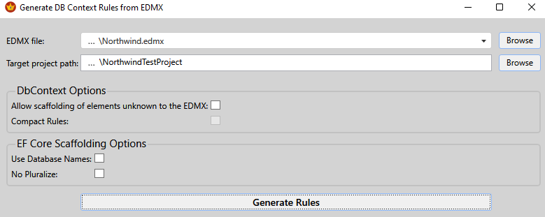
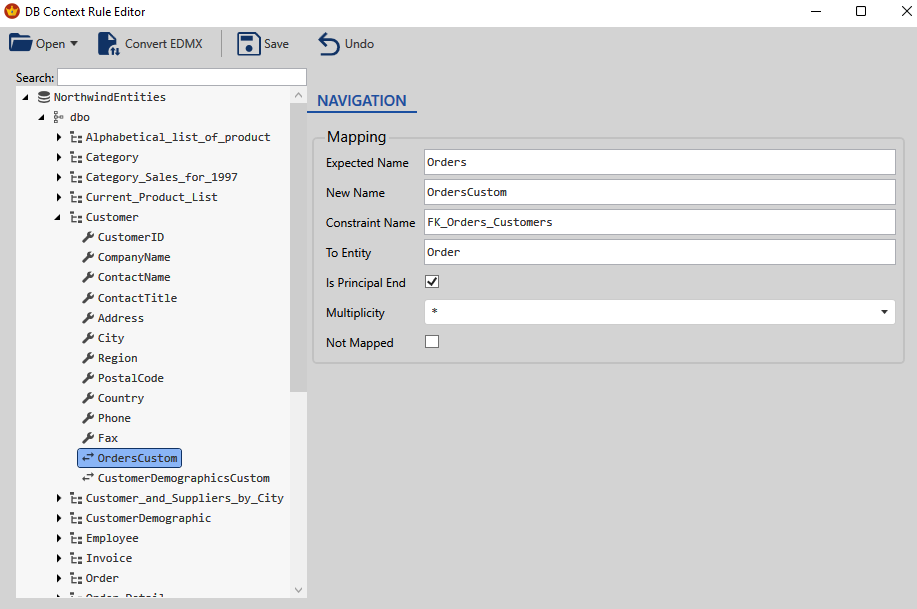

# Entity Framework Ruler

[//]: # (![Build status]&#40;https://github.com/R4ND3LL/EntityFrameworkRuler/actions/workflows/dotnet.yml/badge.svg&#41;)
[](https://www.nuget.org/packages/EntityFrameworkRuler/)
[](https://www.nuget.org/packages/EntityFrameworkRuler.Design/)
[](https://www.nuget.org/packages/EntityFrameworkRuler.Editor/)
[](https://www.nuget.org/packages/EntityFrameworkRuler.Common/)

Provides a reasonable way to do DB-first development with EF Core by allowing the customization of the reverse engineered model (i.e. scaffolding).  All customizations are stored in a JSON file that can be edited by hand, or with the [VS Extension](https://marketplace.visualstudio.com/items?itemName=Randell.EF-Ruler) installed.

Primary Use Cases:
- Upgrade from EF6 to EF Core and keep all customizations that were applied by the EDMX.
- Using the [VS Extension](https://marketplace.visualstudio.com/items?itemName=Randell.EF-Ruler), customize the model in a GUI editor.  All customizations are applied by the scaffold operation.
- Use custom T4 templates to generate extra code during the scaffolding process, such as DTOs or data services.

Features include:
- Support for EF Core 6 through 10.
- Generate custom code using your own T4 files in the scaffolding process.
- Stored procedure and function support (**NEW AS OF JUNE 20, 2023 v1.2.28**)
- Legacy EF6 (EDMX) migration support
- Class renaming
- Property renaming (including both primitives and navigations)
- Type changing (useful for enum mapping)
- Custom navigations that have no database foreign key, such as adding navigations to views
- Table splitting (multiple entities using subsets of columns from the same table)
- Entity inheritance (TPH, TPT, TPC)
- Auto-naming tables and columns using regex
- Skipping tables or columns
- Forcing inclusion of simple many-to-many entities into the model
- Entity type configuration file splitting

EF Ruler applies customizations from a rule document stored in the project folder.  Rules can be initialized with a call to [ef dbcontext scaffold](https://learn.microsoft.com/en-us/ef/core/managing-schemas/scaffolding/?tabs=dotnet-core-cli), or they can be fully generated from an EDMX such that the scaffolding output will align with the old EF6 EDMX-based model.

> "EF Ruler provides a smooth upgrade path from EF6 to EF Core by ensuring that the reverse engineered model maps from the old EDMX structure."

-------
### Upgrading from EF6 with EDMX:
1) Use the [command line tool](https://www.nuget.org/packages/EntityFrameworkRuler/) or the [VS Extension](https://marketplace.visualstudio.com/items?itemName=Randell.EF-Ruler) to generate DB Context rules from an EDMX file. 
2) Reference [EntityFrameworkRuler.Design](https://www.nuget.org/packages/EntityFrameworkRuler.Design/) from the EF Core project.
3) Run the [ef dbcontext scaffold](https://learn.microsoft.com/en-us/ef/core/managing-schemas/scaffolding/?tabs=dotnet-core-cli) command and the design-time service will do the rest.

-------
### Initializing DB Context Rules _without_ an EDMX:
1) Reference [EntityFrameworkRuler.Design](https://www.nuget.org/packages/EntityFrameworkRuler.Design/) from the EF Core project.
2) Run the [ef dbcontext scaffold](https://learn.microsoft.com/en-us/ef/core/managing-schemas/scaffolding/?tabs=dotnet-core-cli) command and a complete rule file will be generated based on the reverse engineered model.  The rules can then be modified, and changes applied by re-running the [scaffold](https://learn.microsoft.com/en-us/ef/core/managing-schemas/scaffolding/?tabs=dotnet-core-cli) command.

-------
### DB Context Customization and Ongoing DB Maintenance

1) Edit the rules json by hand, or with the [VS Extension](https://marketplace.visualstudio.com/items?itemName=Randell.EF-Ruler) installed, right click on the rules file and go to _Edit DB Context Rules_.
2) Adjust the model as necessary using the editor:
   
3) Apply the customizations (see below).

-------
### Applying Model Customizations:
1) Reference NuGet package [EntityFrameworkRuler.Design](https://www.nuget.org/packages/EntityFrameworkRuler.Design/) from the EF Core project.  This is a design-time reference, meaning it will _not_ appear in the project build output, but will interact with EF Core's reverse engineering process.
2) Run the [ef dbcontext scaffold](https://learn.microsoft.com/en-us/ef/core/managing-schemas/scaffolding/?tabs=dotnet-core-cli) command and the design-time service will apply all changes as per the json rule file.  The rule file itself will also sync up with the reverse engineered model. 

-------
### Adding or Removing Tables From the Model:
By default, a rule file generated from EDMX limits tables and columns to just what was in the EDMX.  That way, an identical model can be generated.

If it's time to add a table or column to the model, adjust the IncludeUnknownTables or IncludeUnknownColumns flags at the relevant level.

If the database schema contains a lot of tables that you don't want to generate entities for, then enabling IncludeUnknownTables is not a good idea.  Instead, manually create the table entry in the rule file (using the [Editor](https://marketplace.visualstudio.com/items?itemName=Randell.EF-Ruler)) and set IncludeUnknownColumns to true.  On the next scaffold, the new entity will be generated fully.

You can remove entities from the model by marking the corresponding table (or column) as _Not Mapped_.

-------

### Entity Configuration Splitting:
The [ef dbcontext scaffold](https://learn.microsoft.com/en-us/ef/core/managing-schemas/scaffolding/?tabs=dotnet-core-cli) command does not natively support splitting entity type configurations into separate files.  Instead, all type configurations are stored in the same file as the context.

With EF Core 7 and later, [EntityFrameworkRuler.Design](https://www.nuget.org/packages/EntityFrameworkRuler.Design/) can split configurations for you.

Just enable "SplitEntityTypeConfigurations" in the rule file (at the root level).

--------

## Installation of the Command Line Tool:
   ```
   > dotnet tool install --global EntityFrameworkRuler --version <the latest version>
   ```
See the [NuGet page](https://www.nuget.org/packages/EntityFrameworkRuler/) for details.

-------
## Command Line Tool Usage:

### To generate rules from an EDMX, run the following:
   ```
   > efruler -g <edmxFilePath> <efCoreProjectBasePath>
   ```
   If both paths are the same, i.e. the EDMX is in the EF Core project folder, it is acceptable to run:
   ```
   > efruler -g <projectFolderWithEdmx>
   ```
DB context rules will be extracted from the EDMX and saved in the EF Core project folder.

### To Apply rules to an _already generated_ EF Core model:
It is _strongly_ recommended to just run [ef dbcontext scaffold](https://learn.microsoft.com/en-us/ef/core/managing-schemas/scaffolding/?tabs=dotnet-core-cli) with the [EntityFrameworkRuler.Design](https://www.nuget.org/packages/EntityFrameworkRuler.Design/) library referenced in order to apply customizations.  However, if this is not an option, the following command can apply renaming and type mapping to existing entities (using Roslyn).  For very large projects, this can take a minute.
   ```
   > efruler -a <efCoreProjectBasePath>
   ```

-------
# API Usage
While the [command line tool](https://www.nuget.org/packages/EntityFrameworkRuler/), [EntityFrameworkRuler.Design package](https://www.nuget.org/packages/EntityFrameworkRuler.Design/), and [VS Extension](https://marketplace.visualstudio.com/items?itemName=Randell.EF-Ruler) are intended to provide all the features necessary to customize the reverse engineered model, **without writing any code**, the API is available and fully extensible if you need to tailor the process further. 

Reference NuGet package [EntityFrameworkRuler.Common](https://www.nuget.org/packages/EntityFrameworkRuler.Common/)
#### To override default services:

```csharp
serviceCollection
   .AddRuler()
   .AddSingleton<IRuleSerializer, MyBinaryRuleSerializer>()
   .AddTransient<IRulerNamingService, MyCustomNamingService>()
   .AddTransient<IEdmxParser, MyEdmxParser>()    
```
#### To generate rules from an EDMX:
```csharp
var generator = new RuleGenerator(); // or use injected IRuleGenerator instance
var response = generator.GenerateRules(edmxPath);
if (response.Success)
    await generator.SaveRules(response.Rules.First(), projectBasePath);
```
#### Apply rules using _Roslyn_ to a project with rules file in the same path:
```csharp
var applicator = new RuleApplicator(); // or use injected IRuleApplicator instance
var response = await applicator.ApplyRulesInProjectPath(projectBasePath);
```
#### Customize rule file name:
```csharp
var generator = new RuleGenerator();
var response = generator.GenerateRules(edmxPath);
if (response.Success)
    await generator.SaveRules(projectBasePath, dbContextRulesFile: "DbContextRules.json", response.Rules.First());
```
#### Handle log activity:
```csharp
var applicator = new RuleApplicator();
applicator.Log += (sender, message) => Console.WriteLine(message);
var response = await applicator.ApplyRulesInProjectPath(projectBasePath);
```

-------
This project is under development!  Check back often, and leave comments [here](https://github.com/R4ND3LL/EntityFrameworkRuler/issues).
